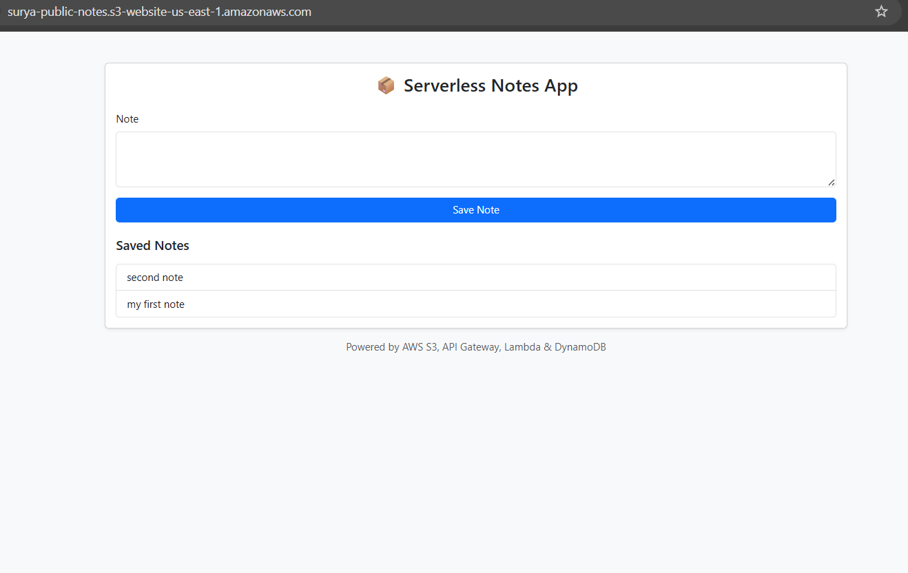

## Serverless Notes App

A simple AWS Serverless application showcasing how to build a full-stack solution using S3, API Gateway, AWS Lambda, and DynamoDB.

The frontend is a static HTML page hosted on Amazon S3, styled with Bootstrap, and communicates with backend APIs via API Gateway.

### Architecture
Browser 
  │ 
  │  Static HTML / JS 
  ▼ 
Amazon S3 (Static Website Hosting) 
  │ 
  │  REST API calls (fetch) 
  ▼ 
Amazon API Gateway 
  │ 
  ▼ 
AWS Lambda (Python) 
  │ 
  ▼ 
Amazon DynamoDB 

### Features

- Static frontend hosted on S3
- Bootstrap-based responsive UI
- REST API integration using JavaScript fetch
- Create and read notes
- Fully serverless (no servers to manage)

Steps:
1. Create s3 bucket with public access
2. Upload index.html to s3 bucket
3. s3 --> Properties --> enable Static website hosting
4. update s3 --> permission --> bucket policy
5. Create Notes table in dynamodb
6. create lambda
7. API gateway: Create rest api for get and post method.
8. Api gateway: Enable CORS + True Lambda proxy integration(Integration request)
9. Update API_URL in index.html

